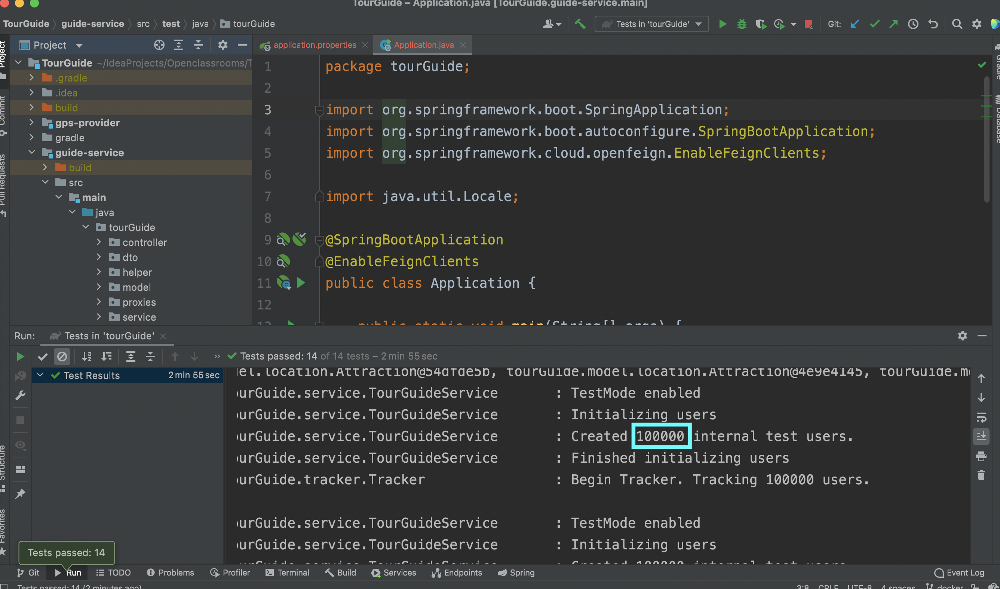
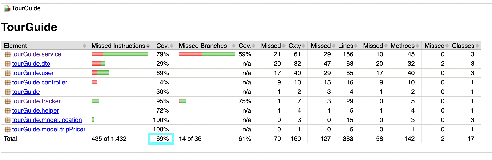

# TourGuideApp
Openclassrooms DA JAVA Project 8.  

- Pour demarrer l'application avec les conteneurs, utilisez la commande "docker-compose up" dans le terminal.  
- La performance pour tester 100,000 utilisateurs a été améliorée:
. 

- Il faut avoir minimum 50% de couverture pour le test:
. 

